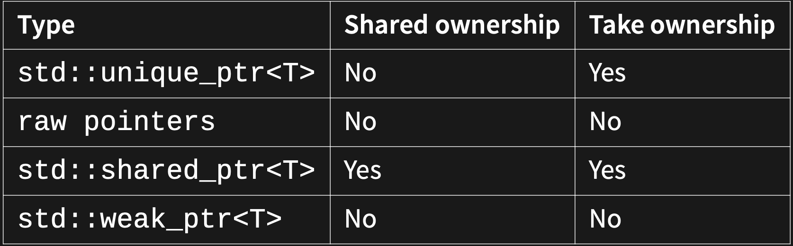
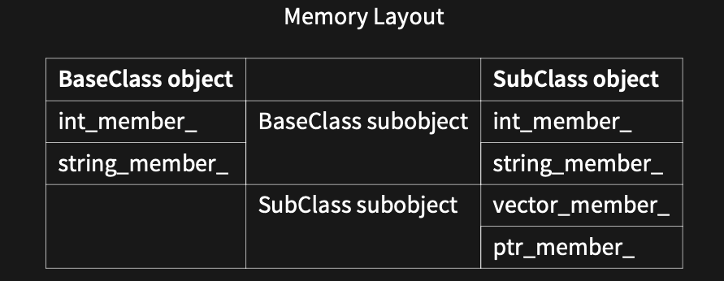
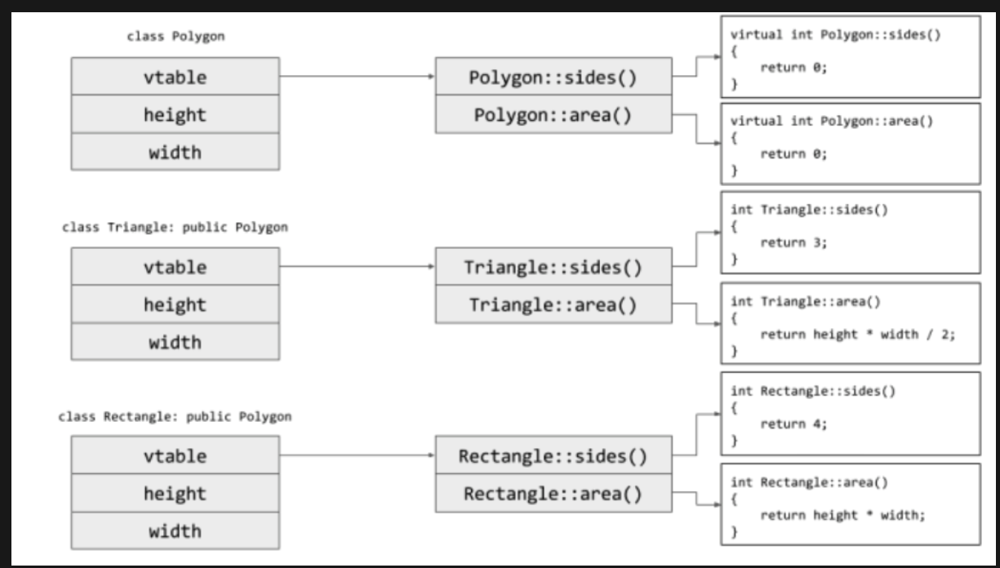
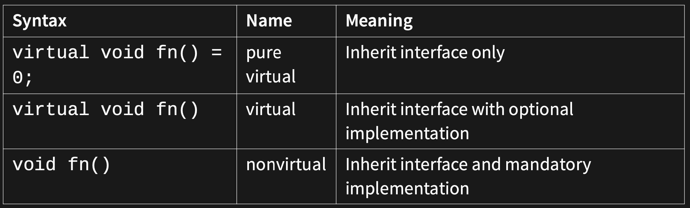
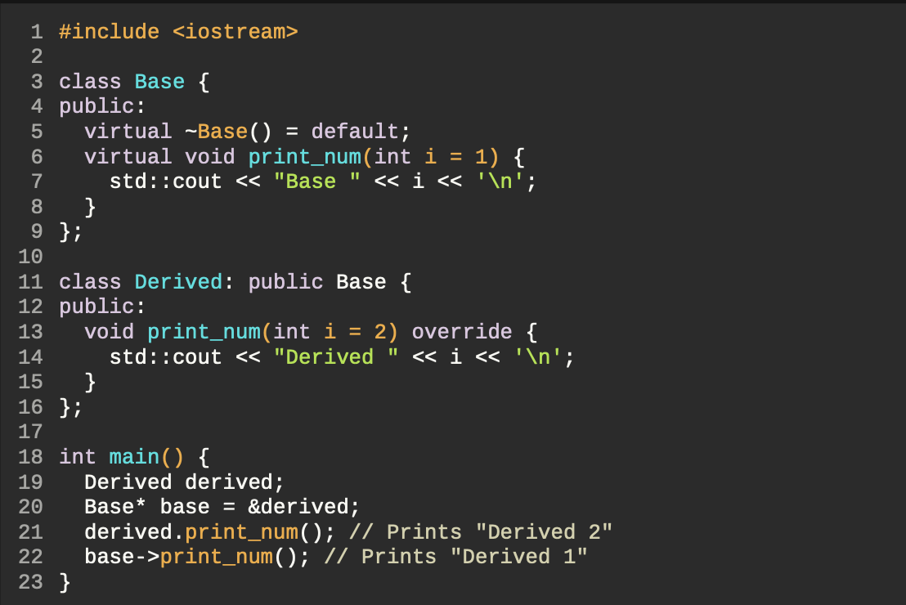
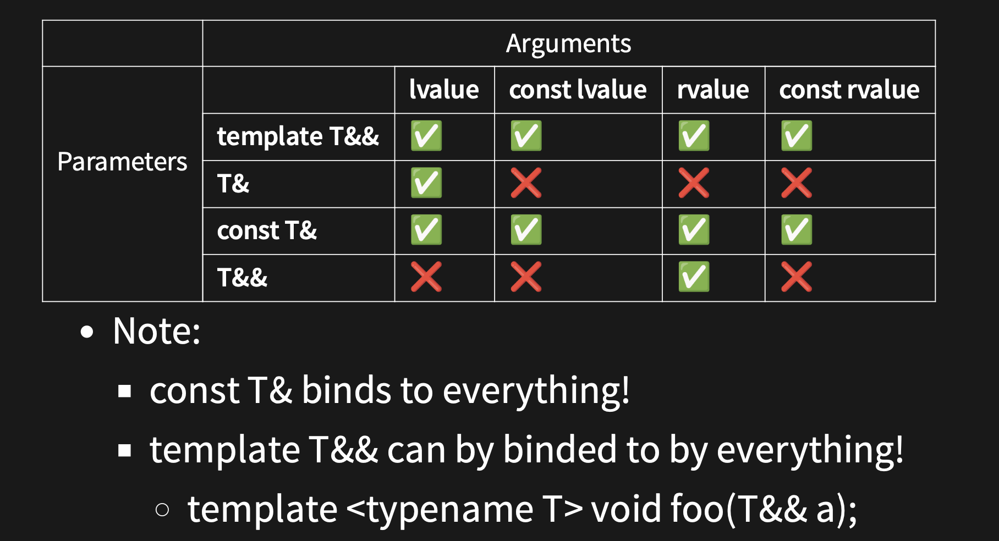

# 6771 Notes

### General Info

Lecturer: Hayden Smith   
Course email: cs6771@cse.unsw.edu.au

- Assignments: 70%
- Final: 30%

Documentation: https://en.cppreference.com/w/

`git reset --soft HEAD~1`

## Types
```c
int val
double val
char ch
bool b
// #include<string>
std::string str = "string"
auto  
const 
```

### Type conversion
```c
auto const val = 0;
auto const val = static_cast<double>(i);
```

## Functions
```c
int main()
{
std::cout << "Hello, World!\n";
}

auto main() -> int
{
std::cout << "Hello, world!\n";
}
```

```c
// Default arguments (always at the end)
#include <string>

std::string rgb(short r = 0, short g = 0, short b = 0) {
    (void)r;
    (void)g;
    (void)b;
    return "";
}

int main() {
    rgb(); // rgb(0, 0, 0);
    rgb(100); // Rgb(100, 0, 0);
    rgb(100, 200); // Rgb(100, 200, 0)
    // rgb(100, , 200); // error
}
```

### Function overloading
```c
#include <catch2/catch.hpp>

auto square(int const x) -> int
{
    return x * x;
}

auto square(double const x) -> double
{
    return x * x;
}

TEST_CASE()
{
    CHECK(square(2) == 4);
    CHECK(square(2.0) == 4.0);
    CHECK(square(2.0) != 4);
}
```
## References
```c
TEST_CASE()
{
    auto i = 1;
    auto& j = i;
    j = 3; 
    CHECK(i == 3); // true
}
```

## Catch2
- A `TEST_CASE` is a uniquely-named scope that has the context for our test framework, and will keep track of all the `CHECK`s and `REQUIRE`s that pass/fail.
- `CHECK` will evaluate an expression and report if it is `false`, but the program will continue to
run.
- `REQUIRE` is closer to an `assert` than a check, in that it terminates the test case, but unlike an `assert`, it will gracefully exit the test case, rather than terminate on the spot. Subsequent test cases are still execute, so unlike an assert, it only aborts a portion of the program, rather than the whole program.

```c
TEST_CASE("Addition works correctly") {
    CHECK(add(1, 1) == 2);
    CHECK(add(2, 2) == 4);
    CHECK(add(2, 2) == 5); // This will fail but the test will continue
    REQUIRE(add(3, 3) == 6); // This will terminate the test if it fails
}
```

- `SECTION` blocks allow us to write setup code for our checks. Every `SECTION` will run all the
code in the `SECTION` block that it's enclosed in, all the way back up to the `TEST_CASE`. This
means that we can modify what we're testing in one section, and still get the same state we
started in all following states at the same level!

```c
TEST_CASE("Factorial calculations", "[factorial]") {
    SECTION("Factorial of 0 is 1") {
        REQUIRE(factorial(0) == 1);
    }
    SECTION("Factorial of 1 is 1") {
        REQUIRE(factorial(1) == 1);
    }
}
```

## STL: Standard Template Library
STL is an architecture for managing **generic and abstract** collections of data with algorithms
- Containers store data, don't know about algorithms
- Algorithms manipulate values referenced by iterators, don't know about containers

## Containers
### Sequential Containers
Organises a finite set of objects into a strict linear arrangement.
  

### Ordered Associative Containers
Organises a finite set of objects into a strict linear arrangement.
  

### Unordered Associative Containers
Provide fast retrieval of data based on keys. The keys are hashed.
  

### Container Performance
Different containers have different time complexity of the same operation.

  

## STL Iterators
Iterators is an abstract notion of a pointer
- Abstract container data as a sequence of objects (i.e. linear)
- connect containers to algorithms

  

- `a.begin()`: abstractly "points" to the first element
- `a.end()`: abstractly "points" to one past the last element
   - `a.end()` is not an invalid iterator value

### Constness & Reverse

```cpp
std::vector<int> ages;
ages.push_back(18);
ages.push_back(19);
ages.push_back(20);

// type of iter would be std::vector<int>::iterator
for (auto iter = ages.begin(); iter != ages.end(); ++iter) {
    (*iter)++; // OK
}
// type of iter would be std::vector<int>::const_iterator
for (auto iter = ages.cbegin(); iter != ages.cend(); ++iter) {
    //(*iter)++; // NOT OK
}
// type of iter would be std::vector<int>::reverse_iterator
for (auto iter = ages.rbegin(); iter != ages.rend(); ++iter) {
    std::cout << *iter << "\n"; // prints 20, 19, 18
}
```

## Iterator Categories
  
  

## Stream Iterators
```cpp
std::ifstream in("data.in");

std::istream_ iterator<int> begin(in);
std::istream_iterator<int> end;

std::cout << *begin++ << "\n"; // read the first int
++begin; // skip the 2nd int
std::cout << *begin++ << "\n"; // read the third int

while (begin != end) {
    std::cout << *begin++ << "\n"; // read and print rest
}
```

## STL Algorithms
STL Algorithms are functions that execute an algorithm on an abstract notion of an iterator. 

```cpp
int main() {
    std::vector<int> nums { 1, 2, 3, 4, 5 };
    auto sum = 0;
    for (auto it = nums.begin(); it != nums.end(); ++it) {
        sum += *it;
    }
    std::cout << sum << "\n";
}
``` 
```cpp
int main() {
    std::vector<int> nums { 1, 2, 3, 4, 5 };
    int sum = std::accumulate(nums.begin(), nums.end(), 0);
    std::cout << sum << "\n";
}
```

## Lambda Functions
```cpp
// General Format
// capture - allows variables to be in scope of lambda function
[capture] (parameters) -> return {
    body
}

[](card const c) -> bool {
    return c.colour == 4;
}
```

```cpp
void add_n(std::vector<int>& v, int n) {
    std::for_each(v.begin(), v.end(), 
                [n] (int& val) { val = val + n; }
    );
}

int main() {
    std::vector<int> v{1,2,3};
    add_n(v, 3);
    // vector = {4, 5, 6}
}
```

## Scope
The scope of a variable is the part of the program where it is accessible
- Define variables as close to first usage as possible
```cpp
int i = 1;
int main() {
    std::cout << i << "\n";
    if (i > 0) {
        int i = 2;
        std::cout << i << "\n";
        {
            int i = 3;
            std::cout << i << "\n";
        }
        std::cout << i << "\n";
    }
    std::cout << i << "\n";
}
// prints: 1, 2, 3, 2, 1
```

## Object Lifetimes
An object is a piece of memory of a specific type that holds some data
- All variables are objects

Object lifetime starts when it comes in scope (constructor called)  t
Object lifetime ends when it goes out of scope (destructor called)

## Construction
Construction describes the process of allocating the memory and setting up for the
creation of an object.

- Generally use `()` to call functions, and to construct objects
- Use `{}` for initialising values into an object

## Namespaces
Used to express that names belong together, prevent similar names from clashing
```cpp
// lexicon.hpp
namespace lexicon {
std::vector<std::string> read
_
lexicon(std::string const& path);
void write
_
lexicon(std::vector<std::string> const&, std::string const& path);
} // namespace lexicon
```

### Anonymous namespaces
```cpp
namespace word_ladder {
namespace {
bool valid_word(std::string const& word);
} // namespace
} // namespace word_ladder
```

### Aliases
We can also use namespace aliases to give a namespace a new name.
```cpp
namespace denton = std;

denton::cout << "hello world";
```

## Object Oriented Programming
`private` variables should end with a `_`

```cpp
class foo {
public:
    // Members accessible by everyone
    foo(); // The default constructor.
protected:
    // Members accessible by members, friends, and subclasses
    // Will discuss this when we do advanced OOP in future weeks.
private:
    // Accessible only by members and friends
    void private_member_function();
    int private_data_member_;
public:
    // May define multiple sections of the same name
};
```

## Constructor
```cpp
class myclass {
public:
    myclass(int i) {
        i_ = i;
    }
    int getval() {
        return i_;
    }
private:
    int i_;
};

int main() {
    auto mc = myclass { 1 };
    std::cout << mc.getval() << "\n";
}
```

### Constructor Initialiser List
The initialisation phase **occurs before the body** of the constructor is executed,
regardless of whether the initialiser list is supplied.

```cpp
class myclass {
public:
    myclass(int i): i_ {i} {
        // empty constructor body
    }

    int getval() {
        return i_;
    }
private:
    int i_;
};

// summary
for each data member in declaration order
    if it has an user defined initialiser
        Initialise it using the user  defined initialiser
    else if it is of a built-in type (numeric, pointer, bool, char, etc.)
        do nothing (leave it as whatever was in memory before)
    else
        Initialise it using its default constructor
```

### Delegating Constructors 
```cpp
class dummy {
public:
    explicit dummy(int const& i): s_ { "Hello world" }, val_ { i } {
    }

    // initialiser list calls other constructor
    explicit dummy(): dummy(5) {
    }

    std::string const& get_s() {
        return s_;
    }

    int get_val() {
        return val_;
    }
    
private:
    std::string s_;
    const int val_;
};
```

## Destructors
Called when object goes out of scope
- free pointers
- close files
- unlock mutexes

```cpp
// file1.cpp
class MyClass {
    ~MyClass();
};

// file2.cpp
MyClass::~MyClass() {
     // Definition here
}
```

## `This` pointers
`this` is a pointer that points to the object through which the member function is accessed. It is **automatically passed** to all **non-static** member functions as a hidden argument.

- `*this` deferences: and returns the objects
- `this->member`: accesses a member variable 

```cpp
class myclass {
public:
    myclass(int i) {
        this->i_ = i;
    }

    int getval() {
        return this->i_;
    }
private:
    int i_;
};
```

## Class Scope
  

## Classes and Structs
`structs` and `class` are almost identical
- All members of a `struct` are **public** by default
- All members of a `class` are **private** by default

## `Explicit`
If a constructor for a class has 1 parameter, the compiler will create an implicit type conversion from the parameter to the class
```cpp
class age {
public:
    explicit age(int age): age_ { age } {
        // constructor body
    }

auto getAge() { 
    return age_; 
}

private:
    int age_;
};

int main() {
    // unsuccesfully calls age constructor, 'explicit'
    age a3 = 20;
    std::cout << a3.getAge() << "\n"; // 20
}
```

## `Const` Members
Member functions are by default only callable by **non-const** objects
- a `const` method will be valid for `const` and **non-const** objects

```cpp
class person {
public:
    person(std::string const& name): name_ { name } {
    }

    auto set_name(std::string const& name) -> void {
        name_ = name;
    }

    auto get_name() -> std::string const& {
        return name_; 
    }

    auto get_name() const -> std::string const& {
        return name_; 
    }

private:
    std::string name_;
};
auto main() -> int {
    person const p2 { "Hayden" };
    std::cout << p2.get_name() << "\n"; // will only work on the const get_name()
}
```

## `Static` Members
`Static` members belong to the class as opposed to a particular
object.
- These are essentially globals defined inside the scope of the class

```cpp
class user {
public:
    user(std::string const& name): name_ { name } {
    }
    static auto valid_name(std::string const& name) -> bool {
        return name.length() < 20;
    }

private:
    std::string name_;
};

auto main() -> int {
    auto n = std::string { "Santa Clause" };
    if (user::valid_name(n)) {
    user user1 { n };
    }
}
```

##  `friend` 
`friend` is a function, class, or method that is granted access to the private and protected members of another class

- A friend function is **not a member of the class**, so it does not have the implicit `this` pointer. It is a **regular function** with access privileges.
- Not inherited

```cpp
class MyClass {
public:
    MyClass(int val) : privateVar(val) {}

    friend void showPrivateVar(const MyClass& obj) {
        std::cout << "Friend function called: " << obj.privateVar << std::endl;
    }
private:
    int privateVar;
};

int main() {
    MyClass obj(42);
    showPrivateVar(obj);       // how to call a friend
}
```

- A class can declare **another class** as a friend. All member functions of the friend class will have access to the private and protected members of the class that granted friendship.

```cpp
class Child {
    //Mother class members can access the private parts of class Child.
    friend class Mother;
};
```

## Defaults
The synthesized default constructor is generated for a class only if it declares no constructors.

  

Deleting unused default member functions:  
- `<function declaration> = default;`
- `<function declaration> = delete;`

- If line 11 is uncommented, then line 20 won't work.
  
  

##  Operator Overload
Allows us to use currently understood semantics to define class methods. 

- At least one of the operands in the operator function must be a user-defined type
```cpp
class point {
public:
    point(int x, int y): x_ { x }, y_ { y } {};

    friend point operator+(point const& lhs, point const& rhs);

    friend std::ostream& operator<<(std::ostream& os,
    point const& p);

private:
    int x_;
    int y_;
};

point operator+(point const& lhs, point const& rhs) {
    return point(lhs.x_+ rhs.x_, lhs.y_+ rhs.y_);
}

std::ostream& operator<<(std::ostream& os, point const& p) {
    os << "(" << p.x_<< "," << p.y_<< ")";
    return os;
}

auto main() -> int {
    point p1 { 1, 2 };
    point p2 { 2, 3 };
    std::cout << p1 + p2 << "\n";
}
```
- Advantages
  - Reuse existing code semantics
  - No verbosity for simple operations
- Disadvantages
  - Reduced context on operations
- Only create an overload if your type has a single, obvious meaning to an operator

  

- `members` when the operation is called with instance
- `friend` when the operation is called without instance
  - Allows function to access private members of class.
  - Even if they don't require access to private details

### Overload: Compound Assignment
```cpp
class point {
public:
    point(int x, int y): x_ { x }, y_ { y } {};
    point& operator*=(point const& p);
    point& operator*=(int i);
private:
    int x_;
    int y_;
};

// Only one arg since its a member function 
point& point::operator*=(point const& p){
    x_+= p.x_;
    y_+= p.y_;
    return *this;
}

// Only one arg since its a member function 
point& point::operator*=(int i) { 
    x_ *= i;
    y_ *= i;
    return *this;
}    
```

### Overload: Relational & Equality
```cpp
class point {
public:
    point(int x, int y): x_ { x }, y_ { y } { }

    friend bool operator==(point const& p1, point const& p2) {
        return p1.x_== p2.x_ and p1.y_ == p2.y_; 
    }
    friend bool operator!=(point const& p1, point const& p2) {
        return not(p1 == p2);
    }
    friend bool operator<(point const& p1, point const& p2) {
        return p1.x_ < p2.x_ and p1.y_ < p2.y_;
    }
    friend bool operator>(point const& p1, point const& p2){
        return p2 < p1;
    }
    friend bool operator<=(point const& p1, point const& p2) {
        return not(p2 < p1);
    }
    friend bool operator>=(point const& p1, point const& p2) {
        return not(p1 < p2);
    }
private:
    int x_;
    int y_;
};
```

### Overload: Assignment
```cpp
class point {
public:
    point(int x, int y): x_ { x }, y_ { y } {};
    point& operator=(point const& p);
private:
    int x_;
    int y_;
};

point& point::operator=(point const& p) {
    x_= p.x_;
    y_= p.y_;
    return *this;
}
```

### Overload: Subscript
```cpp
class point {
public:
    point(int x, int y): x_ { x }, y_ { y } {};

    int& operator[](int i) {
        return i == 0 ? x_: y_;
    }
    
    int operator[](int i) const {
        return i == 0 ? x_: y_;
    }
private:
    int x_;
    int y_;
};
```

### Overload: Increment/Decrement
```cpp
// pre increment ++i;
RoadPosition& RoadPosition::operator++() {
    this->tick_();
    return *this;
}

// post increment i++;
RoadPosition RoadPosition::operator++(int) {
    RoadPosition rp = *this;
    this->tick_();
    return rp;
}

void RoadPosition::tick_() {
    ++(this->km_from_sydney_);
}
```

### Custom Iterators
Each iterator has certain properties
- `Category` (input, output, forward, bidirectional, random-access)
- `Value` type (T)
- `Reference` Type (T& or const T&)
- `Pointer` Type (T* or T* const) 
  - Not strictly required
- `Difference` Type (type used to count how far it is between iterators)

```cpp
class Iterator {
    public:
        using iterator_category = std::forward_iterator_tag;
        using value_type = T;
        using reference = T&;
        using pointer = T*; // Not strictly required, but nice to have.
        using difference_type = int;

        reference operator*() const;
        Iterator& operator++();
        Iterator operator++(int) {
            auto copy { *this };
            ++(*this);
            return copy;
        }

        // This one isn't strictly required, but it's nice to have.
        pointer operator->() const { return &(operator*()); }

        friend bool operator==(const Iterator& lhs, const Iterator& rhs) {};
        friend bool operator!=(const Iterator& lhs, const Iterator& rhs) { 
            return !(lhs == rhs); 
        }
    };
```

### Container Requirements
- `container` only need `std::[cr]begin, std::[cr]end`
- Easiest way is to define `begin`/`end`/`cbegin`/`cend` methods
- By convention, we also define a type `Container::[const_]iterator`

```cpp
class Container {
    class iterator  {
        // ...
    }
    
    using iterator = Iterator;
    using const_iterator = Iterator;

    // Need to define these.
    iterator begin();
    iterator end();

    const_iterator begin() const { return cbegin(); }
    const_iterator cbegin() const;
    const_iterator end() const { return cend(); }
    const_iterator cend() const;
};
```

### Custom Bidirectional Iterators
- Need to define `operator--()` on your iterator
- Need to move from `c.end()` to the last element
  -   c.end() can't just be nullptr

```cpp
class Container {
    // Make the iterator
    class iterator {
        ...
    };
    
    using reverse_iterator = iterator
    using const_reverse_iterator = iterator

    reverse_iterator rbegin();
    reverse_iterator rend();

    const_reverse_iterator rbegin() const { return crbegin(); }
    const_reverse_iterator crbegin();
    const_reverse_iterator rend() const { return crend(); }
    const_reverse_iterator crend() const;
};
```

### Automatic Access Iterators
```cpp
class Container {
    // Make the iterator
    class iterator {
        ...
    };
    
    using reverse_iterator = iterator
    using const_reverse_iterator = iterator

    reverse_iterator rbegin();
    reverse_iterator rend();

    const_reverse_iterator rbegin() const { return crbegin(); }
    const_reverse_iterator crbegin();
    const_reverse_iterator rend() const { return crend(); }
    const_reverse_iterator crend() const;
};
```

### Random Access Iterators
- Reverse iterators can be created by `std::reverse_iterator`
- `rbegin()` stores `end()`, so `*rbegin` is actually `*(--end())`

  

```cpp
class Container {
    // Make the iterator using these.
    using reverse_iterator = std::reverse_iterator<iterator>;
    using const_reverse_iterator = std::reverse_iterator<const_iterator>;

    // Need to define these.
    reverse_iterator rbegin() { return reverse_iterator { end() }; }
    reverse_iterator rend() { return reverse_iterator { begin() }; }

    // If you want const reverse iterators (hint: you do), define these.
    const_reverse_iterator rbegin() const { return crbegin(); }
    const_reverse_iterator rend() const { return crend(); }
    const_reverse_iterator crbegin() const { return const_reverse_iterator { cend() }; }
    const_reverse_iterator crend() const { return const_reverse_iterator { cbegin() }; }
};
```

## Exceptions
Exceptions are for handling exceptional circumstances (handing run-time anomalies)
- **Throw by value, catch by const reference**

```cpp
try {
    // Code that may throw an exception
} catch (/* exception type */) {
    // Do something with the exception
} catch (...) { // any exception
    // Do something with the exception
}
```

### Exception Objects
Any **type** derived from `std::exception`,  eg `throw std::out_of_range("Exception!");`
- https://en.cppreference.com/w/cpp/error/exception
- `#include<exception>` for `std::exception object` 
- `#include<stdexcept>` for objects that inherit `std::exception`

  

```cpp
auto main() -> int {
    std::vector<int> i tems { 97, 84, 72, 65 };
    std::cout << "Enter an index: ";
    for (int print_index; std::cin >> print_index;) {
        if (print_index == -1) break;

        try {
            std::cout << items.at(static_cast<unsigned int>(print_index)) << '\n';
            items.resize(items.size() + 10);
        } catch (const std::out_of_range& e) {
            std::cout << "Index out of bounds\n";
        } catch (...) {
            std::cout << "Something else happened";
        }
        std::cout << "Enter an index: ";
    }
}
```

### Catching Exceptions
Always catch using a `const` reference
-  more efficient, less copying
-  no slicing problem 

```cpp
class Giraffe {
public:
    Giraffe() { std::cout << "Giraffe constructed" << '\n'; }
    Giraffe(const Giraffe& g) { std::cout << "Giraffe copy-constructed" << '\n'; }
    ~Giraffe() { std::cout << "Giraffe destructed" << '\n'; }
};

void zebra() {
    throw Giraffe {};
}

void llama() {
    try {
        zebra();
    } catch (const Giraffe& g) {
        (void) g;
        std::cout << "caught in llama; rethrow" << '\n';
        throw;
    }
}

int main() {
    try {
        llama();
    } catch (const Giraffe& g) {
        (void) g;
        std::cout << "caught in main" << '\n';
    }
}

// prints
Giraffe constructed
caught in llama; rethrow
caught in main
Giraffe destructed
```

### Exceptions Under the hood
#### Throwing an Object
`throw x`: exception mechanism creates a **copy** of x. Managed by the runtime system until it is caught by a catch block. Original x goes **out of scope**, so when catching `const int& e` references the copied object.

```cpp
void throwException() {
    int x = 5;
    throw x; // `x` is copied and the copy is thrown
}

int main() {
    try {
        throwException();
    // `e` is a reference to the copied `x`
    } catch (const int& e) { 
        std::cout << "Caught exception: " << e << std::endl;
    }
}
```

## Exception Safety 
### No-Throw Guarantee (failure transparency)
Operations are **guaranteed to succeed**, even in exceptional circumstances.
  - Exceptions **may occur**, but are **handled internally**
- No exceptions are visible to the client
- Examples: Closing file, Freeing memory, creating trivial object on stack

The `noexcept` specifier, **does not actually prevent a function from throwing an exception**.
- https://en.cppreference.com/w/cpp/language/noexcept_spec

```cpp
class S {
public:
    int foo() const; // may throw
}
class S {
public:
    int foo() const noexcept; // does not throw
}
```

### Strong Exception Safety (commit or rollback semantics)
Operations **can fail**, but failed operations are guaranteed to have **no visible effects**.
- Most common level of exception safety in c++
- Example: allocating more memory

  

### Basic Exception Safety (no-leak guarentee)
Partial execution of failed operations can cause side effects. 
- All invariants must be preserved
- No resources are leaked

### No Exception Safety
No guarantees
- Don't write C++ with no exception safety
- Hard to debug
- Easy to fix --> wrap resources and attach lifetimes (basic exception safety)

### Exceptions and Catch21
  

## Resource Management
- a user-provided constructor prevents automatic synthesis of a default constructor.

### Lifetimes
- Returning `references` need care.
- Object must always outlive reference.

```cpp
auto okay(int& i) -> int& {
    return i;
}

auto okay(int& i) -> int const& {
    return i;
}

auto not_okay(int i) -> int& {
    return i;
}
auto not_okay() -> int& {
    auto i = 0;
    return i;
}
```

### `std::vector<int>` under the hood

```cpp
class my_vec {
    // Constructor
    my_vec(int size): data_{new int[size]}, size_{size}, capacity_{size} {}

    // Copy constructor
    my_vec(my_vec const&) = default;
    // Copy assignment
    my_vec& operator=(my_vec const&) = default;

    // Move constructor
    my_vec(my_vec&&) noexcept = default;
    // Move assignment
    my_vec& operator=(my_vec&&) noexcept = default;

    // Destructor
    ~my_vec() {};
    int* data_;
    int size_;
    int capacity_;
}
```
```cpp
// Call constructor.
auto vec_short = my_vec(2);
auto vec_long = my_vec(9);

// Doesn't do anything
auto& vec_ref = vec_long;

// Calls copy constructor.
auto vec_short2 = vec_short;

// Calls copy assignment.
vec_short2 = vec_long;

// Calls move constructor.
auto vec_long2 = std::move(vec_long);

// Calls move assignment
vec_long2 = std::move(vec_short);
```

## Lvalue and Rvalue
`lvalues`: An expression that is an object reference
- **defined address in memory**
- variable name, subscript reference

`rvalues`: An expression that is NOT an object reference
- **no storage associated with it**
- object literal


### Lvalue References
```cpp
void f(my_vec& x);
```
- `T&`: lvalue reference
- `T const&`: constant lvalue reference

### Rvalue References
```cpp
void f(my_vec&& x);
```
- `T&&`: rvalue reference

If rvalue ference `&&x` is passed from `main` to `f`, then main has **promised** it won't be used anymore. However in `f`, `x` becomes an lvalue reference

- An rvalue reference parameter is an lvalue inside the function

### `std::move`
```cpp
// Looks something like this.
T&& move(T& value) {
    return static_cast<T&&>(value);
}
```

Converts an lvalue to an rvalue so "move constructor/assignment" can use it.

```cpp
// std::move(y) returns &&T, which calls x(&&y) constructor
T x = std::move(y);
```
- Always declare your moves as `noexcept`
- Unless specificed, objects that have been moved are in a **valid but unspecified state**

### `delete` Copy/Move

```cpp
class T {
    T(const T&) = delete;
    T(T&&) = delete;
    T& operator=(const T&) = delete;
    T& operator=(T&&) = delete;
};
```

## RAII
`RAII`= Resource Acquisition Is Initialization

- Resource is the heap object
- **Acquire** resource in **constructor**
- **Release** resource in **destructor**

Object destructors should free the member variables (no mem leaks)

## Smart Pointers
Smart pointers are ways of wrapping unnamed (raw pointer) heap objects in
named stack objects so that object lifetimes can be managed much more safely.
- `unique_ptr` + `raw pointers`
- `shared_ptr` + `weak_ptr`

  

## Unique Pointer
`std::unique_ptr<T>`
- The unique pointer owns the object
- When the unique pointer is destructed, the underlying object is too

`raw pointer` (observer)
- Unique pointer may have many observers
- When unique_ptr is **destructed**, you cannot access the raw pointers (no checks exist)

use `nullptr` not `NULL` in C++

```cpp
int main() {
    auto up1 = std::unique_ptr<int>{new int};
    // auto up2 = up1; // no copy constructor
    std::unique_ptr<int> up3;
    // up3 = up2; // no copy assignment
    up3.reset(up1.release()); // OK
    auto up4 = std::move(up3); // OK (preferred over line above)

    std::cout << up4.get() << "\n"; // raw pointer 
    std::cout << *up4 << "\n"; // deferences pointer 
    std::cout << *up1 << "\n"; // deferences pointer 
}
```

**Observer Pointer**
```cpp
int main() {
    auto up1 = std::unique_ptr<int>{new int{0}};
    *up1 = 5;
    std::cout << *up1 << "\n"; // 5
    auto op1 = up1.get(); // OBSERVER
    *op1 = 6;
    std::cout << *op1 << "\n"; // 6
    up1.reset();
    std::cout << *op1 << "\n"; // undefined 
}
```

**Remove `new` and `delete`**

```cpp
auto up2 = std::unique_ptr<std::string>(new std::string("Hello"));

// use this instead
auto up3 = std::make_unique<std::string>("Hello");
```

## Shared Pointer
`std::shared_ptr<T>`
- Several shared pointers **share** ownership of the object
- A reference counted pointer
- When destructed, if it is the only shared pointer left pointing at the object, then the **object** is destroyed

`std::weak_ptr<T>` (observer does not contribute to count)
- Weak pointers are used with shared pointers when:
  - You don't want to add to the reference count
  - You want to be able to check if the underlying data is still valid 

```cpp
auto main() -> int {
    auto x = std::make_shared<int>(5);
    auto y = std::shared_ptr<int>(x);
    std::cout << "use count: " << x.use_count() << "\n"; // 2
    std::cout << "value: " << *x << "\n"; // 5

    x.reset(); // Memory still exists, due to y.
    std::cout << "use count: " << y.use_count() << "\n"; // 1
    std::cout << "value: " << *y << "\n"; // 5

    y.reset(); // Deletes the memory, since no one else owns the memory
    std::cout << "use count: " << x.use_count() << "\n"; // 0
    std::cout << "value: " << *y << "\n"; // seg fault
}
```

**Weak Pointer**
```cpp
auto main() -> int {
    auto x = std::make_shared<int>(1);
    auto wp = std::weak_ptr<int>(x); 
    
    auto y = wp.lock(); // creates a temp shared_pointer

    // check raw pointer is still valid
    if (y != nullptr) { 
        std::cout << "Attempt 1: " << *y << '\n'; // 1
    }
}
```

## Stack Unwinding
Stack unwinding is the process of exiting the stack frames until we find an **exception handler** for the function
- This calls any **destructors** on the way out
- Any resources not managed by destructors **won't** get freed up
- If an `exception` is thrown during stack unwinding (from destructor), `std::terminate` is called.
- All `exceptions` that occur inside a destructor should be handled inside the destructor

```cpp
void g() {
    throw std::runtime_error{""};
}

int main() {
    auto ptr = new int{5};
    g();
    // Never executed.
    delete ptr;
}
```

```cpp
void g() {
    throw std::runtime_error{""};
}
int main() {
    auto ptr = std::make_unique<int>(5);
    g();
}
```
## Polymorphism & Generics
**Polymorphism**: Provision of a single interface to entities of different types

- **Static Polymorphism**
  - Function overloading
  - Templates (generics)
    - `std::vector<int>`
    - `std::vector<double>`
- **Dynamics Polymorphism**
  - `virtual` functions and inheritance

<br>

**Generics**: Generalising software components sto be independent of a particular type
- Example: STL 

## Inheritance
**Iheritance**: ability to create new classes based on existing ones
- Supported by class derivation
- `: public baseClass`
  - visibility can be: `public`, `private`, `protected`
  - if you specifiy `private` all baseClass members are now `private`
```cpp
class BaseClass {
public:
    int get_int_member() { return int_member_; }
    std::string get_class_name() {
        return "BaseClass"
    };
private:
    int int_member_;
    std::string string_member_;
}

class SubClass: public BaseClass {
public:
    std::string get_class_name() {
        return "SubClass";
    }
private:
    std::vector<int> vector_member_;
    std::unique_ptr<int> ptr_member_;
}
```

  

### Object Slicing

```cpp
void print_class_name(BaseClass base) {
    std::cout << base.get_class_name() << '\n'; // BaseClass, BaseClass
}

BaseClass base_class;
SubClass subclass;
print_class_name(base_class);
print_class_name(subclass);
```

- since `print_class_name` takes in a `BaseClass`, the compiler only stores enough memory for a `BaseClass`, resulting in the `SubClass` object being sliced
- Solution: Pass by reference to let the compiler know how big the class is

## `virtual` and `override`
When you need to override member functions use `virtual` and `override`
- `override` is not required, however fails to compile if the function does not exist in the BaseClass
```cpp
class BaseClass {
public:
    int get_member() { return member_; }

    virtual std::string get_class_name() {
        return "BaseClass"
    };
private:
    int member_;
}

class SubClass: public BaseClass {
public:
    std::string get_class_name() override {
        return "SubClass";
    }
private:
    int sub_class_data_;
}
```

## Vtables
Each class has a VTable stored in the data segment
- A vtable is an array of function pointers that says which definition each virtual
function points to for that class

  

## `Final`
Specifies to the compiler "this is not virtual for any subclasses"
- If the compiler has a variable of type `SubClass&`, it now no longer needs to look it up in the vtable
- static binding for `SubClass&`, but dynamic binding for
`BaseClass&`
```cpp
class BaseClass {
public:
    int get_member() { return member_; }
    virtual std::string get_class_name() {
        return "BaseClass"
    };
private:
    int member_;
}

class SubClass: public BaseClass {
public:
    std::string get_class_name() override final {
        return "SubClass";
    }
private:
    int sub_class_data_;
}
```

## Virtual Functions
- **Virtual functions** are good for when you have a default implementation that subclasses may want to overwrite
- A **pure virtual function** specifies a function that a class must **override** in order to not be abstract.

  

```cpp
class Shape {
// Virtual function
virtual void draw(Canvas&) {}

// Pure virtual function
virtual void draw(Canvas&) = 0;
};
```

## Abstract Base Classes
If a class has at least one pure `vitural` method, the class is **abstract** and cannot be constructed.

## Creating Polymorphic Objects
If you want to store a polymorphic object, use a pointer

```cpp
auto base = std::vector<std::unique_ptr<BaseClass>>();

base.push_back(std::make_unique<BaseClass>());
base.push_back(std::make_unique<Subclass1>());
base.push_back(std::make_unique<Subclass2>());
```

## Inheritance and Constructors
Every subclass constructor **must** call a **base class** constructor
- If none is manually called, the default constructor is used
- A subclass cannot initialise fields defined in the base class
- Abstract classes must have constructors

```cpp
class BaseClass {
public:
    BaseClass(int member): int_member_{member} {}
private:
    int int_member_;
    std::string string_
    member_;
}

class SubClass: public BaseClass {
public:
    SubClass(int member, std::unique_ptr<int>&& ptr):
        BaseClass(member), ptr_member_(std::move(ptr)) {}
private:
}
```

##  Destructing Polymorphic Objects
- When creating a class to be inherited from, make the destructor virtual
- Remember: When you declare a destructor, the move constructor and assignment are
not synthesized

```cpp
class BaseClass {
    BaseClass(BaseClass&&) = default;
    BaseClass& operator=(BaseClass&&) = default;
    virtual ~BaseClass() = default;
}
```

## Static and Dynamic Types
- **Static type** is the type it is **declared** as (compile time)
- **Dynamic type** is the type of the **object itself** (run time)
- An object that is neither **reference** or **pointer** has **static type = dynamic type**

```cpp
auto base_class = BaseClass();
auto subclass = SubClass();
auto sub_copy = subclass;

// static = Base, dynamic = base
const BaseClass& base_to_base{base_class}; 

// static = Base, dynamic = sub
const BaseClass& base_to_sub{subclass};
```

- **Static binding**: Decide which function to call at compile time (based on static type)
- **Dynamic binding**: Decide which function to call at runtime (based on dynamic type)

### Up-cast
Casting from a derived class to a base class is called up-casting
- always safe, so can it is an **implict cast**
```cpp
auto dog = Dog();
Animal& animal = dog;
Animal* animal = &do g;
```

### Down-cast
Casting from a base class to a derived class is called down-casting
- not always safe
- The compiler doesn't know if an Animal happens to be a Dog
  - If you know it is, you can use `static_cast`
  - Otherwise, you can use `dynamic_cast`

```cpp
Animal& animal_dog{Dog()};
Animal& animal_cat{Cat();};

// Attempt to down-cast with references.
Dog& dog_ref{static_cast<Dog&>(animal_dog)};
Dog& dog_ref{dynamic_cast<Dog&>(animal_dog)};
```

## Covaraints 
Overriding `return` types
- valid to change type to **sub class**

```cpp
class Base {
    virtual LandAnimal& get_favorite_animal();
};

class Derived: public Base {
    // No compile: Not all animals are land animals.
    Animal& get_favorite_animal() override;
    // Compiles: All land animals are land animals.
    LandAnimal& get_favorite_animal() override;
    // Compiles: All dogs are land animals.
    Dog& get_favorite_animal() override;
};
```

## Contravariants
Overriding **parameter** types
- valid to change type to **parent class**

```cpp
class Base {
    virtual void use_animal(LandAnimal&);
};
class Derived: public Base {
// Compiles: All land animals are valid input (animals).
void use_animal(Animal&) override;
// Compiles: All land animals are valid input (land animals).
void use_animal(LandAnimal&) override;
// Fails to compile: Not All land animals are valid input (dogs).
void use_animal(Dog&) override;
};
```

## Default Arguments And Virtuals
**Avoid default arguments when overriding virtual functions**
- **Default arguments** are determined at **compile time** 
- Hence, default arguments need to use the `static type` of the function.

  

## Templates
**Function template**: Prescription (i.e. instruction) for the compiler to generate
particular instances of a function varying by type.
- Generation of a templated function for a particular type `T` only happens when a
call to that function is seen during compile time

```cpp
template <typename T>
auto min(T a, T b) -> T {
    return a < b ? a : b;
}
auto main() -> int {
    std::cout << min(1, 2) << "\n"; // calls int min(int, int)
    std::cout << min(1.0, 2.0) << "\n"; // calls double min(double, double)
}
```

- `T` is a template type parameter
- `template <typename>` is the template paramter list

## Type and Nontype parameters
```cpp
template<typename T, std::size_t size>
```
- **Type parameter**: Unknown type with no value (`size`)
- **Nontype parameter**: Known type with unknown value (`T`)

## Class Templates
```cpp
template<typename T>
class stack {
public:
    auto push(T const& item) -> void;
    auto pop() -> void;
    auto top() -> T&;
    auto top() const -> const T&;
    auto empty() const -> bool;

    friend auto operator<<(std::ostream& os, const stack& s) -> std::ostream& {
        for (const auto& i : s.stack_) {
            os << i << " ";
        }
        return os;
    }
private:
    std::vector<T> stack_;
};

template<typename T>
auto stack<T>::push(T const& item) -> void {
    stack_.push_back(item);
}

template<typename T>
auto stack<T>::pop() -> void {
    stack_.pop_back();
}

template<typename T>
auto stack<T>::top() -> T& {
    return stack_.back();
}

template<typename T>
auto stack<T>::top() const -> T const& {
    return stack_.back();
}

template<typename T>
auto stack<T>::empty() const -> bool {
    return stack_.empty();
}
```

When it comes to templates, we include definitions (i.e. implementation) in the `.h` file
- template definition needs to be known at **compile time**

## Static Members
Each template instantiation has it's own set of `static` members
- `stack<int>` is different to `stack<double>`

## Friends
Each stack instantiation has one unique instantiation of the friend

## Defualt Members
- We can provide default arguments to template types 
- It means we have to update all of our template parameter lists

```cpp
template<typename T, typename CONT = std::vector<T>>
```

## Specialistation
There are two ways we can redefine our generic types for something more specific:

[Partial specialisation](https://en.cppreference.com/w/cpp/language/partial_specialization)

- Describing the template for another form of the template
  - `T*`
  - `std::vector<T>`

[Explicit specialisation](https://en.cppreference.com/w/cpp/language/template_specialization)
- Describing the template for a specific, non-generic type
  - `std::string`
  - `int`

**Note**: Do not specialise functions

### Partial Specialisation
In this case we will specialise for pointer types.

```cpp
template <typename T>
class stack<T*> {
public:
  auto push(T* t) -> void { stack_.push_back(t); }
  auto top() -> T* { return stack_.back(); }
  auto pop() -> void { stack_.pop_back(); }
  auto size() const -> std::size_t { return stack_.size(); };
  auto sum() -> int{
    return std::accumulate(stack_.begin(),
          stack_.end(), 0, [] (int a, T *b) { return a + *b; });
  }
private:
  std::vector<T*> stack_;
};
```

### Explicit Specialisation
Explicit specialisation should only be done on classes.
```cpp
template <typename T>
struct is_void {
  static bool const val = false;
};

template<>
struct is_void<void> {
  static bool const val = true;
};

auto main() -> int {
  std::cout << is_void<int>::val << "\n"; // false
  std::cout << is_void<void>::val << "\n"; // true
}
```

## Type Traits
**Trait**: Class (or class template) that characterises a type  
- Traits allow generic template functions to be parameterised

```cpp
template <typename T>
struct numeric_limits {
  static auto min() -> T;
};

template <>
struct numeric_limits<int> {
  static auto min() -> int { return -99999999 - 1; }
};

template <>
struct numeric_limits<double> {
  static auto min() -> double { return -999999999.99999 - 1.0; }
};

auto main() -> int {
  std::cout << std::numeric_limits<double>::min() << "\n";
  std::cout << std::numeric_limits<int>::min() << "\n";
}
```

## Decltype
- Semantic equivalent of a `typeof` function
  
```cpp
int i;
int j& = i;
decltype(i) x; // int - variable
decltype((j)) y; // int& - lvalue
decltype(5) z; // int - prvalue
```

- `decltype((j))` of variable enclosed by `()` is considered an lvalue expression,  and decltype deduces it as an lvalue reference type.
- so the deduced type of `j` is `int`, and the `()` indicates a reference -> `int&`


**Example:**
```cpp
template <typename It>
auto find(It beg, It end, int index) -> decltype(*beg) {
    for (auto it = beg, int i = 0; beg != end; ++it; ++i) {
        if (i == index) {
            return *it;
        }
    }
    return end;
}
```

## Type Transformations
A number of add, remove, and make functions exist as part of **type traits** that provide an ability to transform types

```cpp
std::remove_reference<int &> // int
std::remove_reference<int &&> // int
std::remove_reference<const int &&> // const int
```

```cpp
std::add_rvalue_reference<int> // int&&
std::add_rvalue_reference<int&&> // int&&
std::add_rvalue_reference<int&> // int&
```

## Binding
  

```cpp
auto print(std::string const& a) -> void {
  std::cout << a << "\n";
}

auto goo() -> std::string const {
  return "C++";
}

auto main() -> int {
  auto j = std::string{"C++"};
  auto const& k = "C++";
  print("C++"); // rvalue
  print(goo()); // rvalue
  print(j); // lvalue
  print(k); // const lvalue
}
```

```cpp
template<typename T>
auto print(T&& a) -> void {
  std::cout << a << "\n";
}

auto goo() -> std::string const {
  return "Test";
}

auto main() -> int {
  auto j = int{1};
  auto const& k = 1;

  print(1); // rvalue,       foo(int&&)
  print(goo()); // rvalue    foo(const int&&)
  print(j); // lvalue        foo(int&)
  print(k); // const lvalue  foo(const int&)
}
```

## Constexpr
The `constexpr` specifier declares that it is possible to evaluate the value of the **function** or **variable** at compile time.
- A variable that can be calculated at compile time
- A function that, if its inputs are known at compile time, can be run at compile time

**Benefits**
- Values that can be determined at compile time mean **less processing** is needed at runtime, resulting in an overall **faster program execution**
- Shifts **potential sources of errors** to compile time instead of runtime 

```cpp
constexpr int constexpr_factorial(int n) {
    return n <= 1 ? 1 : n * constexpr_factorial(n - 1);
}

int factorial(int n) {
    return n <= 1 ? 1 : n * factorial(n - 1);
}


auto main() -> int {
    // better than #define
    constexpr int max_n = 10;

    // This is evaluated at compile time (better)
    constexpr int tenfactorial = constexpr_factorial(10);

    // This is evaluated at runtime (worse)
    int ninefactorial = factorial(9);

    std::cout << max_n << "\n"; // 10
    std::cout << tenfactorial << "\n"; // 3628800
    std::cout << ninefactorial << "\n"; // 362880
}
```

## Variadic functions/templates
A variadic functions/templates is one that can take a variable number of arguments.

```cpp
template <typename T>
auto print(const T& msg) -> void {
  std::cout << msg << " ";
}

template <typename A, typename... B>
auto print(A head, B... tail) -> void {
  print(head);
  print(tail...);
}

auto main() -> int {
  print(1, 2.0f); // 1, 2.0
  print(1, 2.0f, "Hello"); // 1, 2.0, Hello
}
```