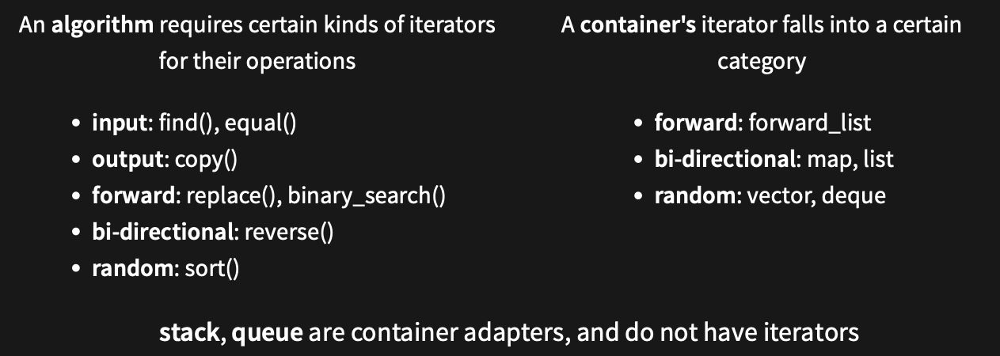

# 6771 Notes

### General Info

Lecturer: Hayden Smith   
Course email: cs6771@cse.unsw.edu.au

- Assignments: 70%
- Final: 30%

Documentation: https://en.cppreference.com/w/

`git reset --soft HEAD~1`

## Types
```c
int val
double val
char ch
bool b
// #include<string>
std::string str = "string"
auto  
const 
```

### Type conversion
```c
auto const val = 0;
auto const val = static_cast<double>(i);
```

## Functions
```c
int main()
{
std::cout << "Hello, World!\n";
}

auto main() -> int
{
std::cout << "Hello, world!\n";
}
```

```c
// Default arguments (always at the end)
#include <string>

std::string rgb(short r = 0, short g = 0, short b = 0) {
    (void)r;
    (void)g;
    (void)b;
    return "";
}

int main() {
    rgb(); // rgb(0, 0, 0);
    rgb(100); // Rgb(100, 0, 0);
    rgb(100, 200); // Rgb(100, 200, 0)
    // rgb(100, , 200); // error
}
```

### Function overloading
```c
#include <catch2/catch.hpp>

auto square(int const x) -> int
{
    return x * x;
}

auto square(double const x) -> double
{
    return x * x;
}

TEST_CASE()
{
    CHECK(square(2) == 4);
    CHECK(square(2.0) == 4.0);
    CHECK(square(2.0) != 4);
}
```
## References
```c
TEST_CASE()
{
    auto i = 1;
    auto& j = i;
    j = 3; 
    CHECK(i == 3); // true
}
```

## Catch2
- A `TEST_CASE` is a uniquely-named scope that has the context for our test framework, and will keep track of all the `CHECK`s and `REQUIRE`s that pass/fail.
- `CHECK` will evaluate an expression and report if it is `false`, but the program will continue to
run.
- `REQUIRE` is closer to an `assert` than a check, in that it terminates the test case, but unlike an `assert`, it will gracefully exit the test case, rather than terminate on the spot. Subsequent test cases are still execute, so unlike an assert, it only aborts a portion of the program, rather than the whole program.

```c
TEST_CASE("Addition works correctly") {
    CHECK(add(1, 1) == 2);
    CHECK(add(2, 2) == 4);
    CHECK(add(2, 2) == 5); // This will fail but the test will continue
    REQUIRE(add(3, 3) == 6); // This will terminate the test if it fails
}
```

- `SECTION` blocks allow us to write setup code for our checks. Every `SECTION` will run all the
code in the `SECTION` block that it's enclosed in, all the way back up to the `TEST_CASE`. This
means that we can modify what we're testing in one section, and still get the same state we
started in all following states at the same level!

```c
TEST_CASE("Factorial calculations", "[factorial]") {
    SECTION("Factorial of 0 is 1") {
        REQUIRE(factorial(0) == 1);
    }
    SECTION("Factorial of 1 is 1") {
        REQUIRE(factorial(1) == 1);
    }
}
```

## STL: Standard Template Library
STL is an architecture for managing **generic and abstract** collections of data with algorithms
- Containers store data, don't know about algorithms
- Algorithms manipulate values referenced by iterators, don't know about containers

## Containers
### Sequential Containers
Organises a finite set of objects into a strict linear arrangement.
  

### Ordered Associative Containers
Organises a finite set of objects into a strict linear arrangement.
  

### Unordered Associative Containers
Provide fast retrieval of data based on keys. The keys are hashed.
  

### Container Performance
Different containers have different time complexity of the same operation.

  

## STL Iterators
Iterators is an abstract notion of a pointer
- Abstract container data as a sequence of objects (i.e. linear)
- connect containers to algorithms

  

- `a.begin()`: abstractly "points" to the first element
- `a.end()`: abstractly "points" to one past the last element
   - `a.end()` is not an invalid iterator value

### Constness & Reverse

```cpp
std::vector<int> ages;
ages.push_back(18);
ages.push_back(19);
ages.push_back(20);

// type of iter would be std::vector<int>::iterator
for (auto iter = ages.begin(); iter != ages.end(); ++iter) {
    (*iter)++; // OK
}
// type of iter would be std::vector<int>::const_iterator
for (auto iter = ages.cbegin(); iter != ages.cend(); ++iter) {
    //(*iter)++; // NOT OK
}
// type of iter would be std::vector<int>::reverse_iterator
for (auto iter = ages.rbegin(); iter != ages.rend(); ++iter) {
    std::cout << *iter << "\n"; // prints 20, 19, 18
}
```

## Iterator Categories
  
  

## Stream Iterators
```cpp
std::ifstream in("data.in");

std::istream_ iterator<int> begin(in);
std::istream_iterator<int> end;

std::cout << *begin++ << "\n"; // read the first int
++begin; // skip the 2nd int
std::cout << *begin++ << "\n"; // read the third int

while (begin != end) {
    std::cout << *begin++ << "\n"; // read and print rest
}
```

## STL Algorithms
STL Algorithms are functions that execute an algorithm on an abstract notion of an iterator. 

```cpp
int main() {
    std::vector<int> nums { 1, 2, 3, 4, 5 };
    auto sum = 0;
    for (auto it = nums.begin(); it != nums.end(); ++it) {
        sum += *it;
    }
    std::cout << sum << "\n";
}
``` 
```cpp
int main() {
    std::vector<int> nums { 1, 2, 3, 4, 5 };
    int sum = std::accumulate(nums.begin(), nums.end(), 0);
    std::cout << sum << "\n";
}
```

## Lambda Functions
```cpp
// General Format
// capture - allows variables to be in scope of lambda function
[capture] (parameters) -> return {
    body
}

[](card const c) -> bool {
    return c.colour == 4;
}
```

```cpp
void add_n(std::vector<int>& v, int n) {
    std::for_each(v.begin(), v.end(), 
                [n] (int& val) { val = val + n; }
    );
}

int main() {
    std::vector<int> v{1,2,3};
    add_n(v, 3);
    // vector = {4, 5, 6}
}
```

## Scope
The scope of a variable is the part of the program where it is accessible
- Define variables as close to first usage as possible
```cpp
int i = 1;
int main() {
    std::cout << i << "\n";
    if (i > 0) {
        int i = 2;
        std::cout << i << "\n";
        {
            int i = 3;
            std::cout << i << "\n";
        }
        std::cout << i << "\n";
    }
    std::cout << i << "\n";
}
// prints: 1, 2, 3, 2, 1
```

## Object Lifetimes
An object is a piece of memory of a specific type that holds some data
- All variables are objects

Object lifetime starts when it comes in scope (constructor called)  t
Object lifetime ends when it goes out of scope (destructor called)

## Construction
Construction describes the process of allocating the memory and setting up for the
creation of an object.

- Generally use `()` to call functions, and to construct objects
- Use `{}` for initialising values into an object

## Namespaces
Used to express that names belong together, prevent similar names from clashing
```cpp
// lexicon.hpp
namespace lexicon {
std::vector<std::string> read
_
lexicon(std::string const& path);
void write
_
lexicon(std::vector<std::string> const&, std::string const& path);
} // namespace lexicon
```

### Anonymous namespaces
```cpp
namespace word_ladder {
namespace {
bool valid_word(std::string const& word);
} // namespace
} // namespace word_ladder
```

### Aliases
We can also use namespace aliases to give a namespace a new name.
```cpp
namespace denton = std;

denton::cout << "hello world";
```

## Object Oriented Programming
`private` variables should end with a `_`

```cpp
class foo {
public:
    // Members accessible by everyone
    foo(); // The default constructor.
protected:
    // Members accessible by members, friends, and subclasses
    // Will discuss this when we do advanced OOP in future weeks.
private:
    // Accessible only by members and friends
    void private_member_function();
    int private_data_member_;
public:
    // May define multiple sections of the same name
};
```

## Constructor
```cpp
class myclass {
public:
    myclass(int i) {
        i_ = i;
    }
    int getval() {
        return i_;
    }
private:
    int i_;
};

int main() {
    auto mc = myclass { 1 };
    std::cout << mc.getval() << "\n";
}
```

### Constructor Initialiser List
The initialisation phase **occurs before the body** of the constructor is executed,
regardless of whether the initialiser list is supplied.

```cpp
class myclass {
public:
    myclass(int i): i_ {i} {
        // empty constructor body
    }

    int getval() {
        return i_;
    }
private:
    int i_;
};

// summary
for each data member in declaration order
    if it has an user defined initialiser
        Initialise it using the user  defined initialiser
    else if it is of a built-in type (numeric, pointer, bool, char, etc.)
        do nothing (leave it as whatever was in memory before)
    else
        Initialise it using its default constructor
```

### Delegating Constructors 
```cpp
class dummy {
public:
    explicit dummy(int const& i): s_ { "Hello world" }, val_ { i } {
    }

    // initialiser list calls other constructor
    explicit dummy(): dummy(5) {
    }

    std::string const& get_s() {
        return s_;
    }

    int get_val() {
        return val_;
    }
    
private:
    std::string s_;
    const int val_;
};
```

## Destructors
Called when object goes out of scope
- free pointers
- close files
- unlock mutexes

```cpp
// file1.cpp
class MyClass {
    ~MyClass();
};

// file2.cpp
MyClass::~MyClass() {
     // Definition here
}
```

## `This` pointers
A member function has an extra implicit parameter, named `this`
- This is a pointer to the object instance 

```cpp
class myclass {
public:
    myclass(int i) {
        this->i_ = i;
    }

    int getval() {
        return this->i_;
    }
private:
    int i_;
};
```

## Class Scope
  

## Classes and Structs
`structs` and `class` are almost identical
- All members of a `struct` are **public** by default
- All members of a `class` are **private** by default

## `Explicit`
If a constructor for a class has 1 parameter, the compiler will create an implicit type conversion from the parameter to the class
```cpp
class age {
public:
    explicit age(int age): age_ { age } {
        // constructor body
    }

auto getAge() { 
    return age_; 
}

private:
    int age_;
};

int main() {
    // unsuccesfully calls age constructor, 'explicit'
    age a3 = 20;
    std::cout << a3.getAge() << "\n"; // 20
}
```

## `Const` Members
Member functions are by default only callable by **non-const** objects
- a `const` method will be valid for `const` and **non-const** objects

```cpp
class person {
public:
    person(std::string const& name): name_ { name } {
    }

    auto set_name(std::string const& name) -> void {
        name_ = name;
    }

    auto get_name() -> std::string const& {
        return name_; 
    }

    auto get_name() const -> std::string const& {
        return name_; 
    }

private:
    std::string name_;
};
auto main() -> int {
    person const p2 { "Hayden" };
    std::cout << p2.get_name() << "\n"; // will only work on the const get_name()
}
```

## `Static` Members
`Static` members belong to the class as opposed to a particular
object.
- These are essentially globals defined inside the scope of the class

```cpp
class user {
public:
    user(std::string const& name): name_ { name } {
    }
    static auto valid_name(std::string const& name) -> bool {
        return name.length() < 20;
    }

private:
    std::string name_;
};

auto main() -> int {
    auto n = std::string { "Santa Clause" };
    if (user::valid_name(n)) {
    user user1 { n };
    }
}
```

## Defaults
The synthesized default constructor is generated for a class only if it declares no constructors.

  

Deleting unused default member functions:  
- `<function declaration> = default;`
- `<function declaration> = delete;`

- If line 11 is uncommented, then line 20 won't work.
  
  

##  Operator Overload
Allows us to use currently understood semantics to define class methods. 

- At least one of the operands in the operator function must be a user-defined type
```cpp
class point {
public:
    point(int x, int y): x_ { x }, y_ { y } {};

    friend point operator+(point const& lhs, point const& rhs);

    friend std::ostream& operator<<(std::ostream& os,
    point const& p);

private:
    int x_;
    int y_;
};

point operator+(point const& lhs, point const& rhs) {
    return point(lhs.x_+ rhs.x_, lhs.y_+ rhs.y_);
}

std::ostream& operator<<(std::ostream& os, point const& p) {
    os << "(" << p.x_<< "," << p.y_<< ")";
    return os;
}

auto main() -> int {
    point p1 { 1, 2 };
    point p2 { 2, 3 };
    std::cout << p1 + p2 << "\n";
}
```
- Advantages
  - Reuse existing code semantics
  - No verbosity for simple operations
- Disadvantages
  - Reduced context on operations
- Only create an overload if your type has a single, obvious meaning to an operator

  

- `members` when the operation is called with instance
- `friend` when the operation is called without instance
  - Allows function to access private members of class.
  - Even if they don't require access to private details

### Overload: Compound Assignment
```cpp
class point {
public:
    point(int x, int y): x_ { x }, y_ { y } {};
    point& operator*=(point const& p);
    point& operator*=(int i);
private:
    int x_;
    int y_;
};

// Only one arg since its a member function 
point& point::operator*=(point const& p){
    x_+= p.x_;
    y_+= p.y_;
    return *this;
}

// Only one arg since its a member function 
point& point::operator*=(int i) { 
    x_ *= i;
    y_ *= i;
    return *this;
}    
```

### Overload: Relational & Equality
```cpp
class point {
public:
    point(int x, int y): x_ { x }, y_ { y } { }

    friend bool operator==(point const& p1, point const& p2) {
        return p1.x_== p2.x_ and p1.y_ == p2.y_; 
    }
    friend bool operator!=(point const& p1, point const& p2) {
        return not(p1 == p2);
    }
    friend bool operator<(point const& p1, point const& p2) {
        return p1.x_ < p2.x_ and p1.y_ < p2.y_;
    }
    friend bool operator>(point const& p1, point const& p2){
        return p2 < p1;
    }
    friend bool operator<=(point const& p1, point const& p2) {
        return not(p2 < p1);
    }
    friend bool operator>=(point const& p1, point const& p2) {
        return not(p1 < p2);
    }
private:
    int x_;
    int y_;
};
```

### Overload: Assignment
```cpp
class point {
public:
    point(int x, int y): x_ { x }, y_ { y } {};
    point& operator=(point const& p);
private:
    int x_;
    int y_;
};

point& point::operator=(point const& p) {
    x_= p.x_;
    y_= p.y_;
    return *this;
}
```

### Overload: Subscript
```cpp
class point {
public:
    point(int x, int y): x_ { x }, y_ { y } {};

    int& operator[](int i) {
        return i == 0 ? x_: y_;
    }
    
    int operator[](int i) const {
        return i == 0 ? x_: y_;
    }
private:
    int x_;
    int y_;
};
```

### Overload: Increment/Decrement
```cpp
// pre increment ++i;
RoadPosition& RoadPosition::operator++() {
    this->tick_();
    return *this;
}

// post increment i++;
RoadPosition RoadPosition::operator++(int) {
    RoadPosition rp = *this;
    this->tick_();
    return rp;
}

void RoadPosition::tick_() {
    ++(this->km_from_sydney_);
}
```

### Custom Iterators
Each iterator has certain properties
- `Category` (input, output, forward, bidirectional, random-access)
- `Value` type (T)
- `Reference` Type (T& or const T&)
- `Pointer` Type (T* or T* const) 
  - Not strictly required
- `Difference` Type (type used to count how far it is between iterators)

```cpp
class Iterator {
    public:
        using iterator_category = std::forward_iterator_tag;
        using value_type = T;
        using reference = T&;
        using pointer = T*; // Not strictly required, but nice to have.
        using difference_type = int;

        reference operator*() const;
        Iterator& operator++();
        Iterator operator++(int) {
            auto copy { *this };
            ++(*this);
            return copy;
        }

        // This one isn't strictly required, but it's nice to have.
        pointer operator->() const { return &(operator*()); }

        friend bool operator==(const Iterator& lhs, const Iterator& rhs) {};
        friend bool operator!=(const Iterator& lhs, const Iterator& rhs) { 
            return !(lhs == rhs); 
        }
    };
```

### Container Requirements
- `container` only need `std::[cr]begin, std::[cr]end`
- Easiest way is to define `begin`/`end`/`cbegin`/`cend` methods
- By convention, we also define a type `Container::[const_]iterator`

```cpp
class Container {
    class iterator  {
        // ...
    }
    
    using iterator = Iterator;
    using const_iterator = Iterator;

    // Need to define these.
    iterator begin();
    iterator end();

    const_iterator begin() const { return cbegin(); }
    const_iterator cbegin() const;
    const_iterator end() const { return cend(); }
    const_iterator cend() const;
};
```

### Custom Bidirectional Iterators
- Need to define `operator--()` on your iterator
- Need to move from `c.end()` to the last element
  -   c.end() can't just be nullptr

```cpp
class Container {
    // Make the iterator
    class iterator {
        ...
    };
    
    using reverse_iterator = iterator
    using const_reverse_iterator = iterator

    reverse_iterator rbegin();
    reverse_iterator rend();

    const_reverse_iterator rbegin() const { return crbegin(); }
    const_reverse_iterator crbegin();
    const_reverse_iterator rend() const { return crend(); }
    const_reverse_iterator crend() const;
};
```

### Automatic Access Iterators
```cpp
class Container {
    // Make the iterator
    class iterator {
        ...
    };
    
    using reverse_iterator = iterator
    using const_reverse_iterator = iterator

    reverse_iterator rbegin();
    reverse_iterator rend();

    const_reverse_iterator rbegin() const { return crbegin(); }
    const_reverse_iterator crbegin();
    const_reverse_iterator rend() const { return crend(); }
    const_reverse_iterator crend() const;
};
```

### Random Access Iterators
- Reverse iterators can be created by `std::reverse_iterator`
- `rbegin()` stores `end()`, so `*rbegin` is actually `*(--end())`

  

```cpp
class Container {
    // Make the iterator using these.
    using reverse_iterator = std::reverse_iterator<iterator>;
    using const_reverse_iterator = std::reverse_iterator<const_iterator>;

    // Need to define these.
    reverse_iterator rbegin() { return reverse_iterator { end() }; }
    reverse_iterator rend() { return reverse_iterator { begin() }; }

    // If you want const reverse iterators (hint: you do), define these.
    const_reverse_iterator rbegin() const { return crbegin(); }
    const_reverse_iterator rend() const { return crend(); }
    const_reverse_iterator crbegin() const { return const_reverse_iterator { cend() }; }
    const_reverse_iterator crend() const { return const_reverse_iterator { cbegin() }; }
};
```

## Exceptions
Exceptions are for handling exceptional circumstances (handing run-time anomalies)
- **Throw by value, catch by const reference**

```cpp
try {
    // Code that may throw an exception
} catch (/* exception type */) {
    // Do something with the exception
} catch (...) { // any exception
    // Do something with the exception
}
```

### Exception Objects
Any **type** derived from `std::exception`,  eg `throw std::out_of_range("Exception!");`
- https://en.cppreference.com/w/cpp/error/exception
- `#include<exception>` for `std::exception object` 
- `#include<stdexcept>` for objects that inherit `std::exception`

  

```cpp
auto main() -> int {
    std::vector<int> i tems { 97, 84, 72, 65 };
    std::cout << "Enter an index: ";
    for (int print_index; std::cin >> print_index;) {
        if (print_index == -1) break;

        try {
            std::cout << items.at(static_cast<unsigned int>(print_index)) << '\n';
            items.resize(items.size() + 10);
        } catch (const std::out_of_range& e) {
            std::cout << "Index out of bounds\n";
        } catch (...) {
            std::cout << "Something else happened";
        }
        std::cout << "Enter an index: ";
    }
}
```

### Catching Exceptions
Always catch using a `const`reference
-  more efficient, less copying
-  no slicing problem 

```cpp
class Giraffe {
public:
    Giraffe() { std::cout << "Giraffe constructed" << '\n'; }
    Giraffe(const Giraffe& g) { std::cout << "Giraffe copy-constructed" << '\n'; }
    ~Giraffe() { std::cout << "Giraffe destructed" << '\n'; }
};

void zebra() {
    throw Giraffe {};
}

void llama() {
    try {
        zebra();
    } catch (const Giraffe& g) {
        (void) g;
        std::cout << "caught in llama; rethrow" << '\n';
        throw;
    }
}

int main() {
    try {
        llama();
    } catch (const Giraffe& g) {
        (void) g;
        std::cout << "caught in main" << '\n';
    }
}

// prints
Giraffe constructed
caught in llama; rethrow
caught in main
Giraffe destructed
```

## Exception Safety 
### No-Throw Guarantee (failure transparency)
Operations are **guaranteed to succeed**, even in exceptional circumstances.
  - Exceptions **may occur**, but are **handled internally**
- No exceptions are visible to the client
- Examples: Closing file, Freeing memory, creating trivial object on stack

The `noexcept` specifier, **does not actually prevent a function from throwing an exception**.
- https://en.cppreference.com/w/cpp/language/noexcept_spec

```cpp
class S {
public:
    int foo() const; // may throw
}
class S {
public:
    int foo() const noexcept; // does not throw
}
```

### Strong Exception Safety (commit or rollback semantics)
Operations **can fail**, but failed operations are guaranteed to have **no visible effects**.
- Most common level of exception safety in c++
- Example: allocating more memory

  

### Basic Exception Safety (no-leak guarentee)
Partial execution of failed operations can cause side effects. 
- All invariants must be preserved
- No resources are leaked

### No Exception Safety
No guarantees
- Don't write C++ with no exception safety
- Hard to debug
- Easy to fix --> wrap resources and attach lifetimes (basic exception safety)

### Exceptions and Catch21
  
